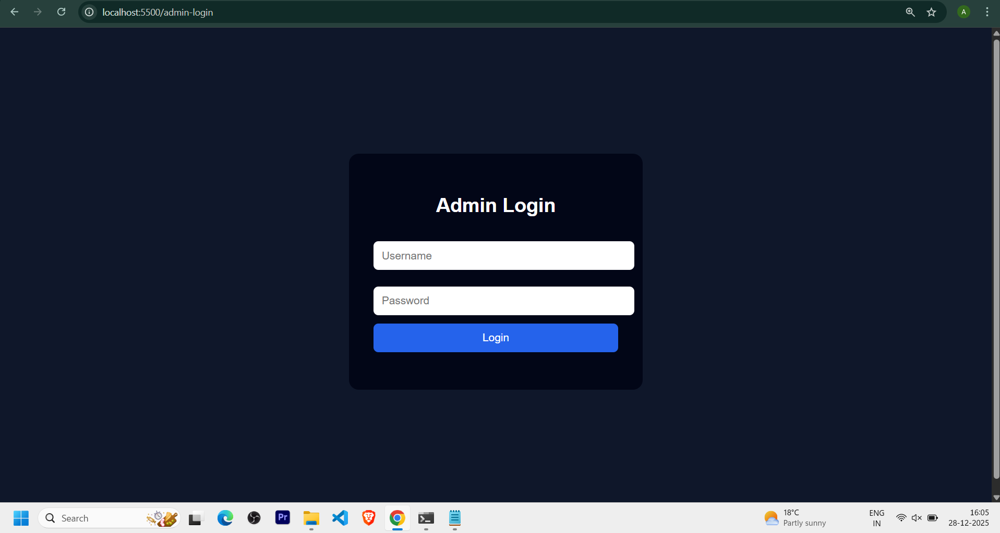
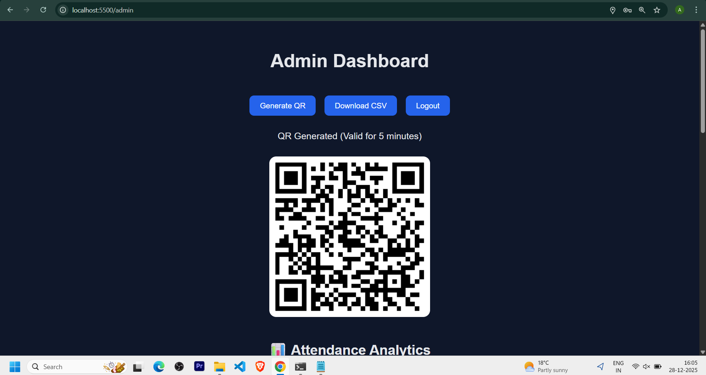
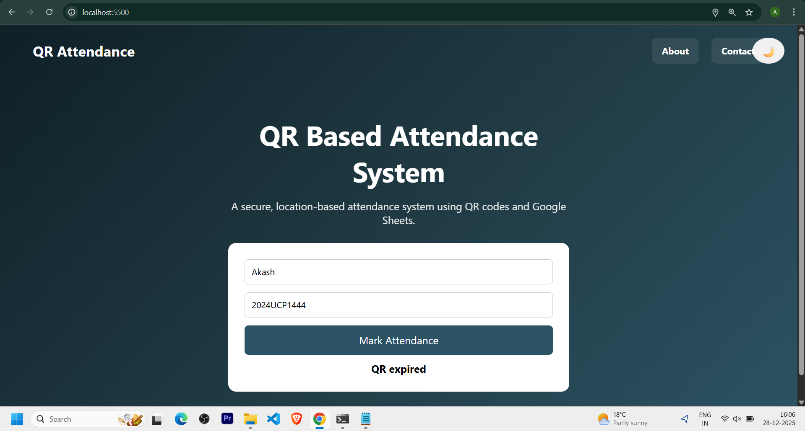
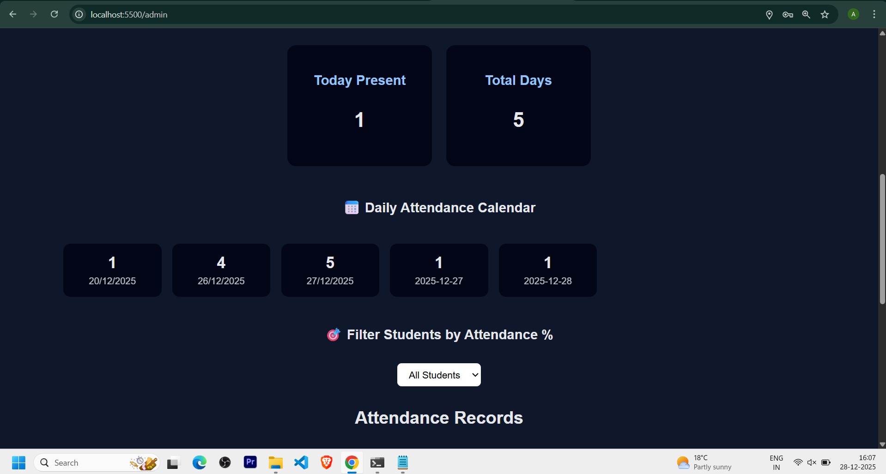
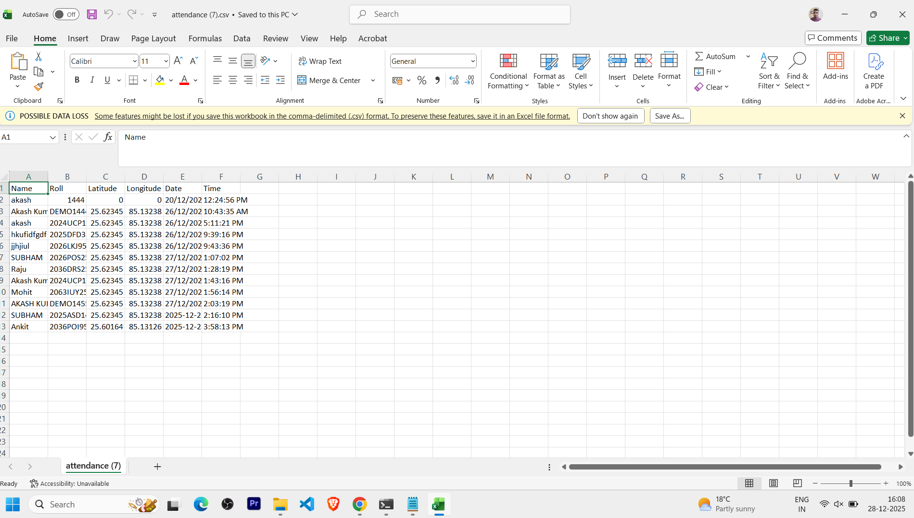
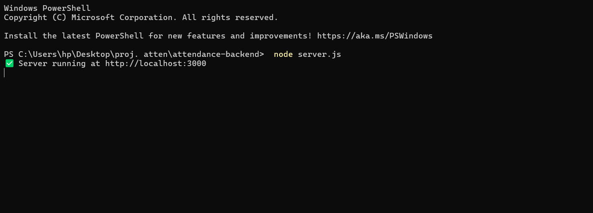

## 🔔 Latest Update (v1.3)

✔ Improved GPS location handling for real-world usage  
✔ Attendance radius increased to **200 meters** to handle mobile & desktop GPS variance  
✔ Fixed IST time mismatch in attendance records  
✔ Reliable admin authentication (token-based)  
✔ Analytics & CSV export fully stable  

> This update makes the system reliable across **mobile phones, laptops, and desktops**.

## 🔄 Recent Updates
- Attendance only allowed if student is within 50m of the admin device
- Added admin login with session-based authentication
- Added QR generation directly from admin dashboard
- Implemented QR expiry (5 minutes) for security
- Restricted attendance to one entry per student per day
- Added device/session-based attendance restriction
- Introduced attendance analytics (calendar view + percentage filter)
- Fixed Excel CSV export formatting issue
- Added dark/light mode with persistence
- Improved UI interactions (About/Contact toggle)

# QR-Based Attendance System 📱📍

This project is a QR-based attendance system developed as an academic project to reduce proxy attendance in college classrooms using real-time location verification.

Students scan a QR code to open the attendance page, allow location access, and mark attendance. Attendance records are stored in Google Sheets, and an admin dashboard is provided to view and download the data in CSV format.

---

## ✨ Features

- QR code based attendance marking  
- Real-time location verification (geo-fencing)  
- Attendance allowed only within a fixed radius  
- One attendance per roll number per day  
- Case-insensitive roll number validation  
- Google Sheets used as backend database  
- Admin dashboard for attendance monitoring  
- CSV export functionality  
- Clean and dark-themed user interface
-📍 GPS-based attendance with **realistic radius handling (200m)**
- 📱 Works consistently on **mobile & desktop devices**

---

## 🛠️ Tech Stack

### Frontend
- HTML  
- CSS  
- JavaScript  

### Backend
- Node.js  
- Express.js  

### APIs
- Google Sheets API  
- Browser Geolocation API  

---

## 📂 Project Structure

qr-attendance-system/
│
├── frontend/
│ ├── index.html # Student attendance page
│ ├── style.css
│ ├── script.js
│ ├── admin.html # Admin dashboard
│ ├── admin.css
│ └── admin.js
│
├── attendance-backend/
│ ├── server.js
│ ├── package.json
│
├── screenshots/
│ ├── student-page.png
│ ├── attendance-success.png
│ ├── admin-dashboard.png
│ ├── google-sheet.png
│ └── backend-running.png
│
├── .gitignore
└── README.md

Backend runs on:
http://localhost:3000

Frontend Setup
cd frontend
npx serve

Open the URL shown in the terminal, for example:
http://localhost:PORT

Admin dashboard:
http://localhost:PORT/admin.html

🔐 Security Note

credentials.json is not uploaded to GitHub for security reasons

Users must add their own Google Sheets API credentials

This project is intended for academic use

## 📸 Screenshots

### 🎓 Student Attendance Page

### ✅ Attendance Success

### 🔐 Admin Login

### 🧑‍💼 Admin Dashboard

### 📱 QR Generation (Admin)

### ⏳ QR Expired Validation

### 📊 Attendance Analytics

### 📄 Excel CSV Export (No Formatting Issue)

### 📄 Google Sheet Data

### ⚙️ Backend Server Running

📌 Limitations & Future Improvements

Suitable for small to medium-scale institutions

Can be extended using a database like MySQL or MongoDB

Admin authentication can be added

Cloud deployment can be implemented

## 📦 Version History

### v1.3 – Production Stable (Current)
- Increased attendance radius to 200m for GPS reliability
- Fixed IST time mismatch issue
- Stable analytics & CSV export
- Fully deployed backend (Render) + frontend (GitHub Pages)

### v1.2
- Improved GPS accuracy handling
- Admin analytics & dashboard fixes

### v1.0
- QR-based attendance system with location verification

👨‍💻 Author

Akash Kumar
B.Tech Computer Science & Engineering
Roll No: 2024UCP1444

