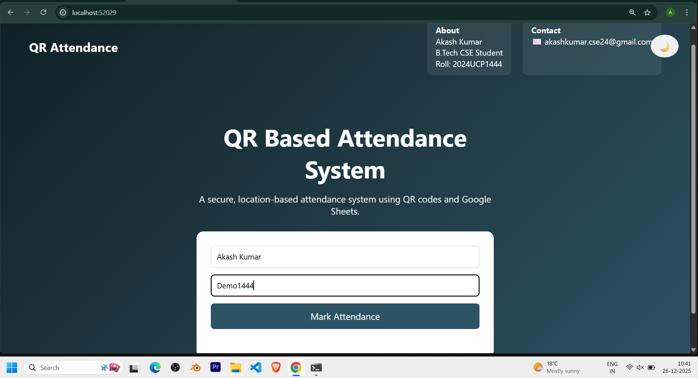
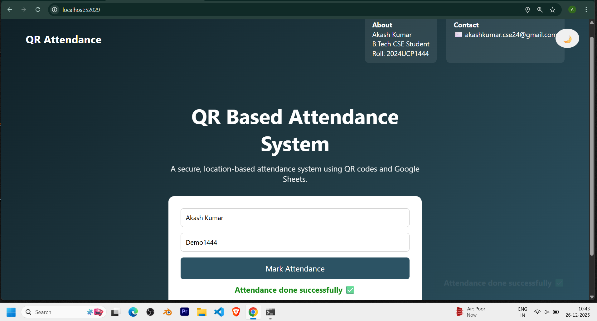
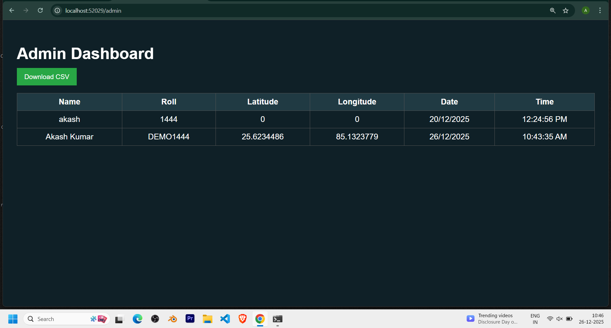
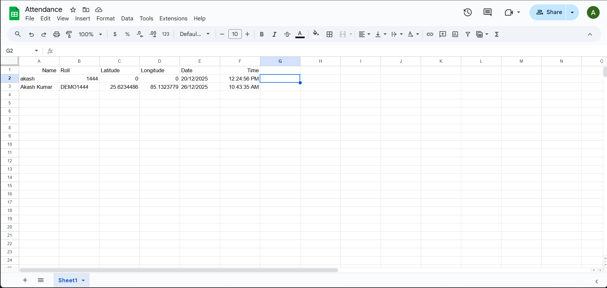

# QR-Based Attendance System 📱📍

This project is a QR-based attendance system developed as an academic project to reduce proxy attendance in college classrooms using real-time location verification.

Students scan a QR code to open the attendance page, allow location access, and mark attendance. Attendance records are stored in Google Sheets, and an admin dashboard is provided to view and download the data in CSV format.

---

## ✨ Features

- QR code based attendance marking  
- Real-time location verification (geo-fencing)  
- Attendance allowed only within a fixed radius  
- One attendance per roll number per day  
- Case-insensitive roll number validation  
- Google Sheets used as backend database  
- Admin dashboard for attendance monitoring  
- CSV export functionality  
- Clean and dark-themed user interface  

---

## 🛠️ Tech Stack

### Frontend
- HTML  
- CSS  
- JavaScript  

### Backend
- Node.js  
- Express.js  

### APIs
- Google Sheets API  
- Browser Geolocation API  

---

## 📂 Project Structure

qr-attendance-system/
│
├── frontend/
│ ├── index.html # Student attendance page
│ ├── style.css
│ ├── script.js
│ ├── admin.html # Admin dashboard
│ ├── admin.css
│ └── admin.js
│
├── attendance-backend/
│ ├── server.js
│ ├── package.json
│
├── screenshots/
│ ├── student-page.png
│ ├── attendance-success.png
│ ├── admin-dashboard.png
│ ├── google-sheet.png
│ └── backend-running.png
│
├── .gitignore
└── README.md

Backend runs on:
http://localhost:3000

Frontend Setup
cd frontend
npx serve

Open the URL shown in the terminal, for example:
http://localhost:PORT

Admin dashboard:
http://localhost:PORT/admin.html

🔐 Security Note

credentials.json is not uploaded to GitHub for security reasons

Users must add their own Google Sheets API credentials

This project is intended for academic use

## 📸 Screenshots

### Student Attendance Page

### Attendance Success

### Admin Dashboard

### Google Sheet Data

\### Backend Server Running

!\[Backend](screenshots/backend-running.png)

📌 Limitations & Future Improvements

Suitable for small to medium-scale institutions

Can be extended using a database like MySQL or MongoDB

Admin authentication can be added

Cloud deployment can be implemented

👨‍💻 Author

Akash Kumar
B.Tech Computer Science & Engineering
Roll No: 2024UCP1444

